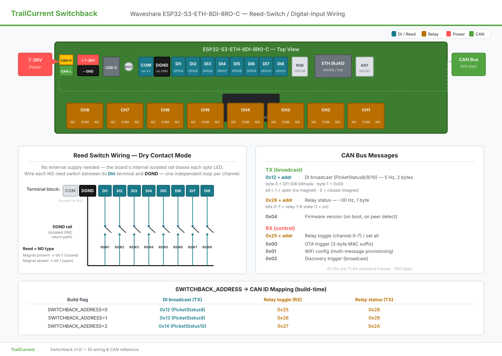

# High-Level Design (HLD) Document

## 1. Project Overview

**Project Title:** Switchback Module

**Description:** A microcontroller-based system that controls 8 high-current relay outputs over a CAN bus and reports their state back to the network. Reused as a slimmed-down [Picket](../../../TrailCurrentPicket/README.md) replacement when 8 reed-switch / digital inputs are sufficient — the same physical board exposes 8 optocoupler-isolated digital inputs that broadcast door / cabinet status in the existing PicketStatus wire format.

**Objective:**
To design and implement a reliable, industrial-grade, CAN-controlled relay module for the TrailCurrent vehicle platform that can also subsume the Picket door-sensing role at locations where 8 inputs cover the wiring need, eliminating a separate node, its enclosure, its CAN address, and its quiescent power draw.

---

## 2. Microcontroller Selection

**Selected Microcontroller:**
**ESP32-S3** ([Waveshare ESP32-S3-ETH-8DI-8RO-C](https://www.waveshare.com/wiki/ESP32-S3-ETH-8DI-8RO-C))
[Datasheet](https://www.espressif.com/sites/default/files/documentation/esp32-s3_datasheet_en.pdf)

**Rationale for Selection:**
- Off-the-shelf industrial DIN-rail board with **8 onboard relays** (10 A @ 250 V AC / 30 V DC) driven through a TCA9554PWR I²C expander. No relay driver circuit to design.
- **8 digital inputs with bidirectional optocoupler isolation** and onboard isolated supply rail — supports both dry-contact (reed switches, buttons) and wet-contact (5–36 V sensors) wiring without external components.
- Onboard isolated CAN transceiver, W5500 Ethernet, RTC with battery backup, SD slot, RGB LED, buzzer.
- 7–36 V wide-input buck converter (or 5 V via USB-C) — directly compatible with vehicle 12 V / 24 V systems.
- DIN-rail enclosure ships with the board.
- Same ESP-IDF / ESP32-S3 toolchain shared across Picket, Solstice, and other TrailCurrent modules.

---

## 3. System Requirements

### 3.1 Functional Requirements

| Requirement | Description |
|------------|-------------|
| Relay Control | Receive CAN commands to toggle individual relays (channel 0–7) or set all relays on/off. |
| Relay Status Reporting | Broadcast the current 8-bit relay state on CAN at ~30 Hz. |
| Digital Input Sensing | Read 8 optocoupler-isolated inputs and broadcast their debounced state on CAN at 5 Hz in PicketStatus wire format. |
| Multi-Module Addressing | Up to 3 modules per CAN bus. CAN IDs offset by `SWITCHBACK_ADDRESS` build flag (0–2). |
| OTA Updates | Accept firmware updates over WiFi triggered via CAN ID 0x00. Dual-OTA partition layout for safe rollback. |
| Auto-Discovery | Respond to CAN-broadcast discovery triggers by joining WiFi and advertising over mDNS for Headwaters to register. |
| Bus-Off Recovery | Detect TWAI bus-off, initiate recovery, and resume TX automatically when the bus is healthy. |
| No-Peer Probe Mode | Slow down TX to 0.5 Hz when no CAN peers are detected; resume normal cadence on first ACK / RX. |

### 3.2 Non-Functional Requirements

| Requirement | Description |
|------------|-------------|
| Reliability | System must operate continuously without disruption indefinitely for solar / off-grid installs. |
| CAN Bus Data Usage | Combined relay status (30 Hz, 1 byte) + DI broadcast (5 Hz, 2 bytes) ≈ 47 frame-bytes/s per module — negligible on a 500 kbps bus. |
| Environmental Tolerance | Operate within typical industrial ranges (board-rated -20 °C to +70 °C). |
| Galvanic Isolation | All relay-side and input-side connections must remain optically / power-isolated from the MCU rail. |
| Cost | Use the off-the-shelf board as-is; no custom PCB required. |

---

## 4. System Architecture Overview

### 4.0 External Wiring Reference

The diagram shows every screw-terminal and connector exposed on the [Waveshare ESP32-S3-ETH-8DI-8RO-C](https://www.waveshare.com/wiki/ESP32-S3-ETH-8DI-8RO-C), the dry-contact reed-switch wiring (no external supply needed — the board's onboard isolated rail provides loop current), and the CAN ID layout for all three `SWITCHBACK_ADDRESS` build values.

### 4.1 Hardware Components

| Component | Description |
|----------|-------------|
| ESP32-S3 (Waveshare ESP32-S3-ETH-8DI-8RO-C) | Main microcontroller with onboard CAN, Ethernet, 8 relays, 8 DIs |
| TCA9554PWR I²C I/O Expander | Drives the 8 relay coils (address 0x20, on internal I²C bus SDA=GPIO42 / SCL=GPIO41) |
| Onboard Optocouplers (input side) | Bidirectional isolation for the 8 digital inputs |
| W5500 Ethernet Controller | SPI-attached, currently unused by firmware (reserved for future expansion) |
| PCF85063ATL RTC | Battery-backed real-time clock (currently unused) |
| Reed Switches / Buttons / Sensors | External — wired to DI terminals via dry- or wet-contact configuration |

### 4.2 Software Components

| Component | Description |
|----------|-------------|
| Main Application (`main.c`) | Boot, peripheral init, task spawning |
| Relay Driver (`relay.c`) | TCA9554 I²C bring-up, per-channel toggle, get-states bitmask |
| CAN Handler (`can_handler.c`) | TWAI driver, RX dispatch, relay-status TX (~30 Hz), DI debounce + DI broadcast (5 Hz) |
| WiFi Config (`wifi_config.c`) | NVS-stored credentials and CAN-based provisioning protocol on ID 0x01 |
| OTA (`ota.c`) | HTTP-based OTA update flow, triggered by CAN ID 0x00 with this module's MAC suffix |
| Discovery (`discovery.c`) | mDNS advertisement + Headwaters confirm-handshake on a one-at-a-time CAN-triggered window |
| CAN Common (`can_common.h`, shared library) | Bus init, alert mask, version-broadcast helper — same module used across all TrailCurrent firmware |

### 4.3 Dual-Role Operation

A single Switchback firmware build runs both functions concurrently. The two roles are independent:

| Role | CAN ID (per `SWITCHBACK_ADDRESS`) | Cadence | Source of Truth |
|---|---|---|---|
| Relay status TX | 0x28 / 0x29 / 0x2A | ~30 Hz | TCA9554 output register cache |
| Relay toggle RX | 0x25 / 0x26 / 0x27 | event-driven | Headwaters / dashboards |
| DI broadcast TX | **0x12 / 0x13 / 0x14** | 5 Hz | 50 ms-debounced GPIO read |

The DI side is a byte-for-byte clone of the Picket message format (1 = open, 0 = closed; debounce window, cadence, and signal layout all identical). It extends the Picket address pool — the canonical DBC name for the new IDs is `PicketStatus8`, `PicketStatus9`, `PicketStatus10`.

---

## 5. Communication Protocol

- **CAN Bus:** 500 kbps, no-ACK mode (TWAI driver in normal mode).
- **Data Format:** See [Switchback README — CAN Protocol](../../README.md#can-protocol) and the canonical [TrailCurrent.dbc](../../../TrailCurrentDocumentation/TrailCurrent.dbc).
- **Transmission Frequency:**
  - Relay status: ~30 Hz (33 ms period) — fast enough that downstream UIs feel responsive after a toggle.
  - DI broadcast: 5 Hz (200 ms period) — matches Picket exactly so the same Headwaters consumer code decodes both.
- **Probe Backoff:** When no peers are observed, both TX paths slow to 0.5 Hz to avoid spamming an empty bus, resuming full rate on first TX_SUCCESS or RX_DATA.

---

## 6. Power Management Strategy

- **Input:** 7–36 V DC via screw terminal (vehicle 12 V or 24 V), or 5 V via USB-C for bench work.
- **Onboard Power:** Built-in MP1605GTF-Z buck converter feeds the ESP32-S3 and isolated rails.
- **Quiescent Draw:** Dominated by the W5500, ESP32 WiFi/BLE radios (idle), and the optocoupler bias current. Significantly lower system draw than running a Switchback + Picket pair at the same location.

---

## 7. Development Tools and Environment

| Tool | Description |
|------|-------------|
| ESP-IDF | Development framework (v5.x) |
| VS Code | Development IDE |
| Git / GitHub | Source control, releases (binaries attached to tagged releases) |
| TrailCurrentCANLibrary | Shared CAN init / version-broadcast component, pulled in via `EXTRA_COMPONENT_DIRS` |
| Documentation Tools | Markdown, DBC for the canonical CAN signal definitions |

---

## 8. Testing and Validation

| Test Type | Description |
|----------|-------------|
| Unit | Per-module — relay driver, DI read path, CAN message parsing |
| Integration | Full firmware on hardware: relay toggle round-trip, DI debounce timing, dual-role TX coexistence |
| Field | Multi-module bus with mixed Picket + Switchback nodes; verify Headwaters decodes 0x0A–0x14 uniformly |
| OTA | Push a new build, verify dual-OTA rollback path on a deliberately corrupt image |

---

## 9. Future Enhancements

- Use the onboard W5500 Ethernet for CAN-over-Ethernet bridging or a direct HTTP control API.
- Wire the RTC to provide a network-independent timestamp for input transitions.
- Add SD-card logging of input-edge events for forensic / diagnostic recall.
- Per-channel relay current sensing (would require an external module — not on this board).

---
